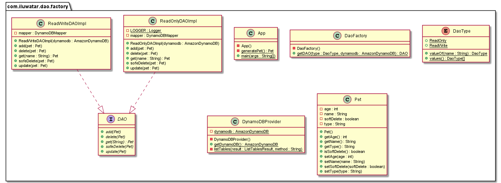

## Name / classification

DAO Factory

## Intent

To hide the process of selecting an appropriate persistence layer or set DAO objects from the business tier, and to allow configuration of DAO features at runtime in a centralized manner. The DAO factory is responsible for determining how to create the DAO object. When the underlying storage is not subject to change from one implementation to another, this strategy can be implemented using the Factory Method pattern to produce a number of DAOs needed by the application.

## Class diagram

## Database (DynamoDB)
This implementation uses DynamoDB as data storage. An instance is created via 
the DynamoDBEmbedded which generates an in-memory and in-process instance of DynamoDB Local that skips HTTP.
A table called "Pets" is then created. Since DynamoDB is a NoSQL database, we only need to specify the keys and do not need to specify other non-key fields when creating a table.
Detailed implementations are in the DynamoDBProvider class.

## References
https://www.oreilly.com/library/view/j2ee-design-patterns/0596004273/re15.html
https://www.oracle.com/java/technologies/dataaccessobject.html
https://docs.aws.amazon.com/amazondynamodb/latest/developerguide/DynamoDBLocal.html
