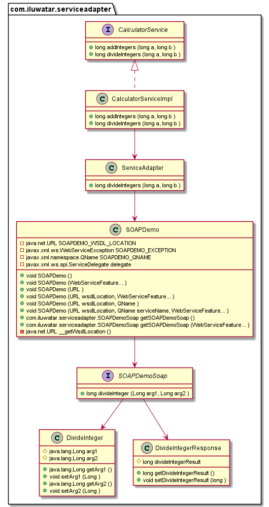

## Intent
Encapsulates the interactions with a remote service, hiding the details of the implementation.

## J2EE Design Pattern

## Class diagram

## Applicability
The Service Adapter pattern is a design pattern used in software development to encapsulate the interactions with a remote service, hiding the details of the implementation when they aren't central to fulfilling the business needs.

## Typical Use Case

* When getting data from third-party services that are written in non-java languate

## Consequences
* Creates hidden dependencies that can break the clients at runtime.

## Credits

* [J2EE Design Patterns](https://www.amazon.com/gp/product/0596004273/ref=as_li_tl?ie=UTF8&camp=1789&creative=9325&creativeASIN=0596004273&linkCode=as2&tag=javadesignpat-20&linkId=48d37c67fb3d845b802fa9b619ad8f31)
* [SOAP Demo Service](https://www.crcind.com/csp/samples/SOAP.Demo.cls)